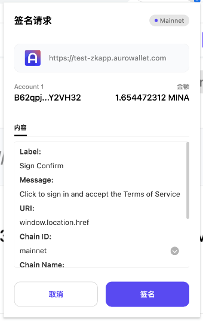

# Sign Message

## Sign Message

this method used for sign easy message.

```typescript
interface SignedData {
    publicKey: string;
    data: string;
    signature: {
        field: string;
        scalar: string;
    };
}

interface ProviderError extends Error {
    message: string;
    code: number;
    data?: unknown;
}
type signBody = {
    message:string
}

const content = `Click "Sign" to sign in. No password needed!

This request will not trigger a blockchain transaction or cost any gas fees.

I accept the Auro Test zKApp Terms of Service: ${window.location.href}

address: ${currentAccount}
iat: ${new Date().getTime()}`;

const signContent:signBody = {
    message:content
}

const signResult: SignedData|ProviderError = await window.mina?
     .signMessage(signContent)
     .catch((err: any) => err);

console.log(signResult)
```

## Sign Json Message

this used for sign json data , wallet will format message.

```typescript

type JsonMessageData  = {
  label:string
  value:string
}


type SignJsonMessageArgs = {
  readonly message: Array<JsonMessageData>
}


const msgParams = [
    { label: "Label:", value: "Sign Confirm" },
    {
      label: "Message:",
      value: "Click to sign in and accept the Terms of Service",
    },
    {
      label: "URI:",
      value: window.location.href,
    },
    {
      label: "Chain ID:",
      value: network.chainId,
    },
    {
      label: "Chain Name:",
      value: network.name,
    },
    {
      label: "Issued At:",
      value: new Date().getTime(),
    },
    {
      label: "Resources:",
      value: "https://docs.aurowallet.com/",
    },
  ];
const signResult:SignedData|ProviderError = await window.mina
    ?.signJsonMessage({
      message: msgParams
    })
    .catch((err: any) => err);

console.log(signResult)

```

<div align="left">

<figure><figcaption><p>sign json message</p></figcaption></figure>

 

<figure><figcaption><p>Sign Easy message</p></figcaption></figure>

</div>


## Verify Message

this methods used for verify signed Message

```typescript
interface SignedData {
  publicKey: string;
  data: string;
  signature: {
    field: string;
    scalar: string;
  }
}

interface VerifyMessageArgs extends SignedData {}

let verifyResult:boolean|ProviderError = await (window as any)?.mina
  ?.verifyMessage(verifyMessageBody)
  .catch((err: any) => err);
console.log(verifyResult)// if verify success,will return true
```
